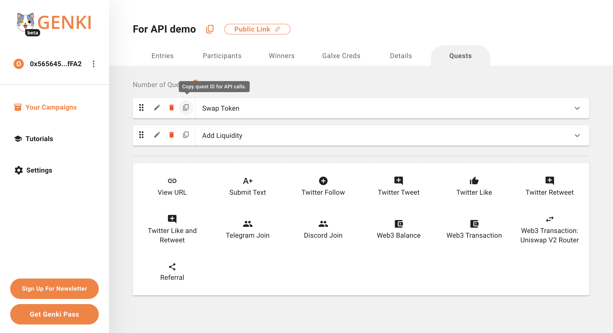
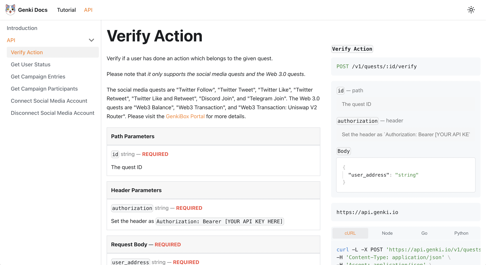

# GenkiBox API Demo

<style>
link{
  display: flex;
  align-content: center;
}
text{
  font-size: 40px
}
</style>

<p align="center">
  <a href="https://api-docs.genki.io/">
      
  </a>
</link>

This project was a example showed how to use Genki API in your application.
- [Demo](https://genkibox-api-demo-web.vercel.app/)

***
## Hoe to use Genki API?
In this case, we will build a popup quest in homepage.

Before starting, there are 2 very important steps to prepare.

First one, please **create an organization** in [GenkiBox Portal](https://beta-box.genki.io/portal). Skip this step if you've already created one.

Second one, please make sure you already have the API key. If you don't have yet,please go to [apply one](https://api-docs.genki.io/getting-started/get-your-api-key) now!


- **Step1: Create a campaign and quests in GenkiBox.**
  - You will need the campaign Id and quest Id for call API, and you can easily copy id through the copy buttom beside campaign name or quests name.
  - I create two quests is "Swap Token" and "Add Liquidity".

 

- **Step2: Choose API as you needed.** 
  - You can find out 6 API endpoints in [Genki API](https://api-docs.genki.io/api). 
  - In this case we will use `Verify Action` and `Get User Status`.



- **Step3: Use Genki API in application.**
  - When user click `Verify` buttom, will trigger `Verify Action` and the `Get User Status` to display is done or not complete quest.
  - The source code in `apps/web/src/views/GenkiDemo/StepsProps`.
  - [Demo Screen Recording](https://drive.google.com/file/d/1sbWaMecuomvmkEsD_47_vmyu4UflRabC/view)

***

## How to start this Demo

> Install dependencies using **yarn**

## `apps/web`
<details>

```sh
yarn
```

start the development server
```sh
yarn dev
```

build with production mode
```sh
yarn build

# start the application after build
yarn start
```
</details>

